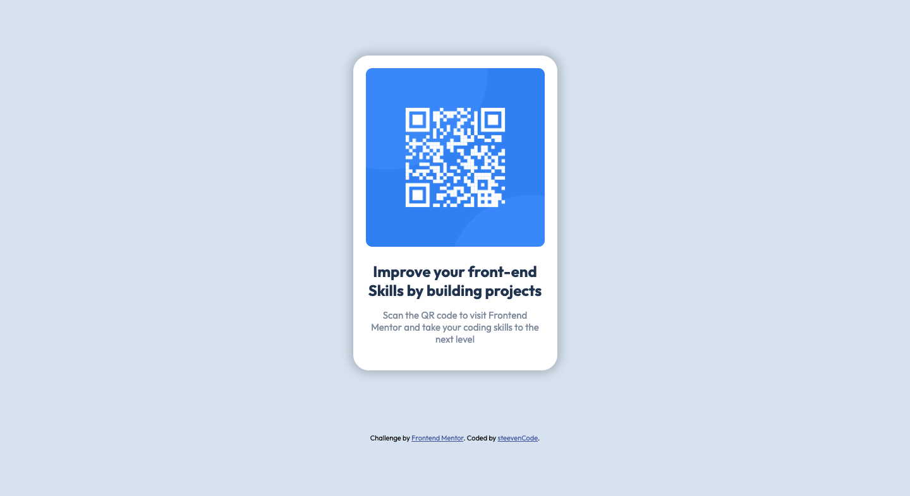

# Frontend Mentor - QR code component solution

This is a solution to the [QR code component challenge on Frontend Mentor](https://www.frontendmentor.io/challenges/qr-code-component-iux_sIO_H).

## Table of contents

- [Overview](#overview)
  - [Screenshot](#screenshot)
  - [Links](#links)
- [My process](#my-process)
  - [Built with](#built-with)
  - [What I learned](#what-i-learned)
  - [Continued development](#continued-development)
  - [Useful resources](#useful-resources)
- [Author](#author)

## Overview

### Links

- Solution URL: [ GitHub code source ](https://github.com/steeven509/qr-code-component-challenge)
- Live Site URL: [ Website ](https://steeven509.github.io/qr-code-component-challenge/)

## My process

### Built with

- Semantic HTML5 markup
- CSS3 custom properties
- Flexbox

## Author

- Frontend Mentor - [steeven509](https://www.frontendmentor.io/profile/steeven509)

